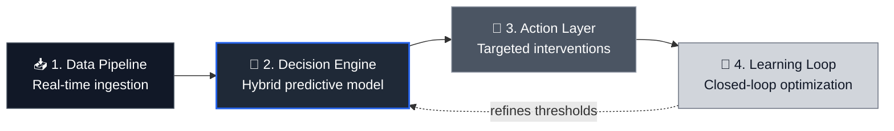
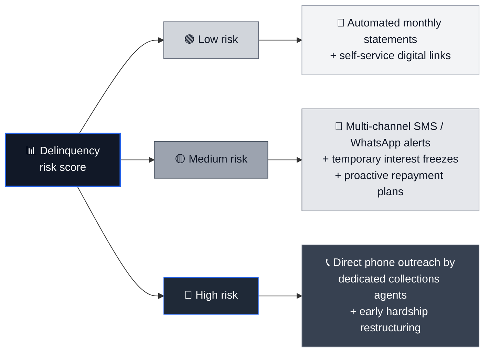

<!-- ═══════════════════════ HEADER ═══════════════════════ -->
<div align="center">


<br/>

<!-- Animated workflow (file: assets/agentic-flow.svg) -->


<br/><br/>


<br/><br/>

<!-- ═══════════════════════ NAVIGATION ═══════════════════════ -->
<a href="#summary"></a>
<a href="#deliverables"></a>
<a href="#architecture"></a>
<a href="#guardrails"></a>
<a href="#impact"></a>
<a href="#run"></a>

</div>


<!-- ═══════════════════════ SUMMARY ═══════════════════════ -->
<a id="summary"></a>

## 📌 Executive Summary

### AI-Powered Autonomous Debt-Management & Collections Strategy

This repository contains an end-to-end **Machine Learning and Agentic AI** solution developed for **Geldium Finance** to modernize debt collection and delinquency risk management.

By shifting from **reactive debt recovery** to **proactive risk mitigation**, the system dynamically identifies at-risk credit cardholders, predicts delinquency probability, and deploys personalized, responsible interventions, while following global financial regulatory frameworks (**ECOA, FCRA, GDPR, FCA**).

<div align="center">

| 🔎 **Identify** | 📊 **Predict** | 🎯 **Intervene** | ⚖️ **Stay Compliant** |
|:---:|:---:|:---:|:---:|
| At-risk credit cardholders | Delinquency probability | Personalized, responsible actions | ECOA • FCRA • GDPR • FCA |

</div>


<!-- ═══════════════════════ DELIVERABLES ═══════════════════════ -->
<a id="deliverables"></a>

## 🛠️ Key Project Deliverables

<table>
<tr>
<td width="50%" valign="top">

### 📄 `Business_Summary_Report_Geldium.docx`
Executive briefing document with portfolio predictive insights, **SMART recommendation frameworks** and ethical AI strategies.

</td>
<td width="50%" valign="top">

### 📽️ `AI_Powered_Collections_Strategy_Geldium.pptx`
High-level C-suite presentation covering system architecture, agentic AI workflows, guardrails and **quantitative business impact**.

</td>
</tr>
<tr>
<td width="50%" valign="top">

### 📊 `Delinquency_prediction_dataset.xlsx`
Portfolio credit card dataset used for **behavioral feature engineering** and risk segmentation.

</td>
<td width="50%" valign="top">

### 🧾 `Task 2_ModelPlan_Template.docx`
Technical **model evaluation plan** and feature mapping template.

</td>
</tr>
</table>


<!-- ═══════════════════════ ARCHITECTURE ═══════════════════════ -->
<a id="architecture"></a>

## 🏗️ System Architecture & Workflow

The autonomous collections system works across **four integrated layers**.



<table>
<tr>
<td width="50%" valign="top">

### 📥 1. Data Pipeline
**Real-time ingestion** that monitors:
- Credit utilization velocity (**>60% risk threshold**)
- Payment friction logs (trailing 6 months)
- Account balance dynamics

</td>
<td width="50%" valign="top">

### 🧠 2. Decision Engine
**Hybrid predictive model** that combines:
- Machine learning delinquency risk scores
- Business rules
- **SHAP** explainability reason codes

Accounts are assigned to **Low**, **Medium** or **High** risk tiers.

</td>
</tr>
<tr>
<td width="50%" valign="top">

### 🎯 3. Action Layer
**Targeted interventions** by risk tier (see below).

</td>
<td width="50%" valign="top">

### 🔁 4. Learning Loop
**Closed-loop optimization** that tracks **30/60/90-day** repayment velocity and engagement rates to refine probability thresholds and lower cost-to-collect.

</td>
</tr>
</table>

### 🎚️ Risk tiers and interventions




<!-- ═══════════════════════ GUARDRAILS ═══════════════════════ -->
<a id="guardrails"></a>

## 🛡️ Responsible AI & Regulatory Guardrails

<table>
<tr>
<td width="33%" valign="top">

### ⚖️ Fairness & Bias Audit
Continuous **Adverse Impact Ratio (AIR)** monitoring across age and regional tiers to enforce the regulatory **80% rule**.

```text
0.80 ≤ AIR ≤ 1.25
```

</td>
<td width="33%" valign="top">

### 🔍 Explainability (XAI)
Extraction of the **top 3 plain-language SHAP reason codes** per account score, to meet Fair Lending and Adverse Action notice mandates.

</td>
<td width="34%" valign="top">

### 📜 Regulatory Compliance
Built-in alignment with the frameworks below.

</td>
</tr>
</table>

<div align="center">

| Framework | Focus |
|:---:|:---|
|  | Non-discrimination |
|  | Data accuracy |
|  | Right to explanation and auditability |
|  | Fair treatment of vulnerable customers |

</div>


<!-- ═══════════════════════ IMPACT ═══════════════════════ -->
<a id="impact"></a>

## 📈 Target Business Impact

<div align="center">

| 📉 **30+ Day Delinquency Rate** | 🤝 **Hardship Plan Opt-In** | 💸 **Operational Costs** | 💰 **Capital Recovery** |
|:---:|:---:|:---:|:---:|
| <h2>15%</h2>Reduction | <h2>25%</h2>Opt-In Rate | <h2>40%</h2>Reduction | <h2>18%</h2>Increase |

</div>

| Metric / KPI | Projected Outcome | Key Driver |
|:---|:---|:---|
| **30+ Day Delinquency Rate** | **15% Reduction** | Proactive hardship intervention before write-off escalation |
| **Hardship Plan Opt-In** | **25% Opt-In Rate** | Personalized SMS/Email outreach offering flexible terms |
| **Operational Costs** | **40% Reduction** | Automation of digital reminders for Low/Medium-Risk cohorts |
| **Capital Recovery** | **18% Increase** | Reallocation of manual agent capacity to severe default cases |


<!-- ═══════════════════════ HOW TO RUN ═══════════════════════ -->
<a id="run"></a>

## 🚀 How to Run & Generate Reports

**1️⃣ Clone the repository**

```bash
git clone https://github.com/paraskosambe-web/GenAI-Powered-Data-Analytics-Job-Simulation.git
cd GenAI-Powered-Data-Analytics-Job-Simulation
```

**2️⃣ Install dependencies**

```bash
pip install -r requirements.txt
```

**3️⃣ Generate documents via Python**

To programmatically generate or update the Word report and PowerPoint presentation:

```bash
python generate_docs.py
```


<!-- ═══════════════════════ AUTHOR ═══════════════════════ -->
## 👤 Author & Governance

<div align="center">

<table>
<tr>
<td align="center" width="50%"><b>Author</b><br/>Paras Kosambe<br/><sub>AI Transformation Consultant (Tata iQ)</sub></td>
<td align="center" width="50%"><b>Organization</b><br/>Tata iQ / Geldium Finance</td>
</tr>
</table>

<br/>

<a href="https://github.com/paraskosambe-web"></a>
<a href="https://www.linkedin.com/in/paras-kosambe"></a>
<a href="mailto:paraskosambe@gmail.com"></a>

<br/><br/>


</div>


